This is the home for all my templates. Feel free to use them!

---
# Latex Article

Well commmented preamble so you don't end up with "preamble blought"

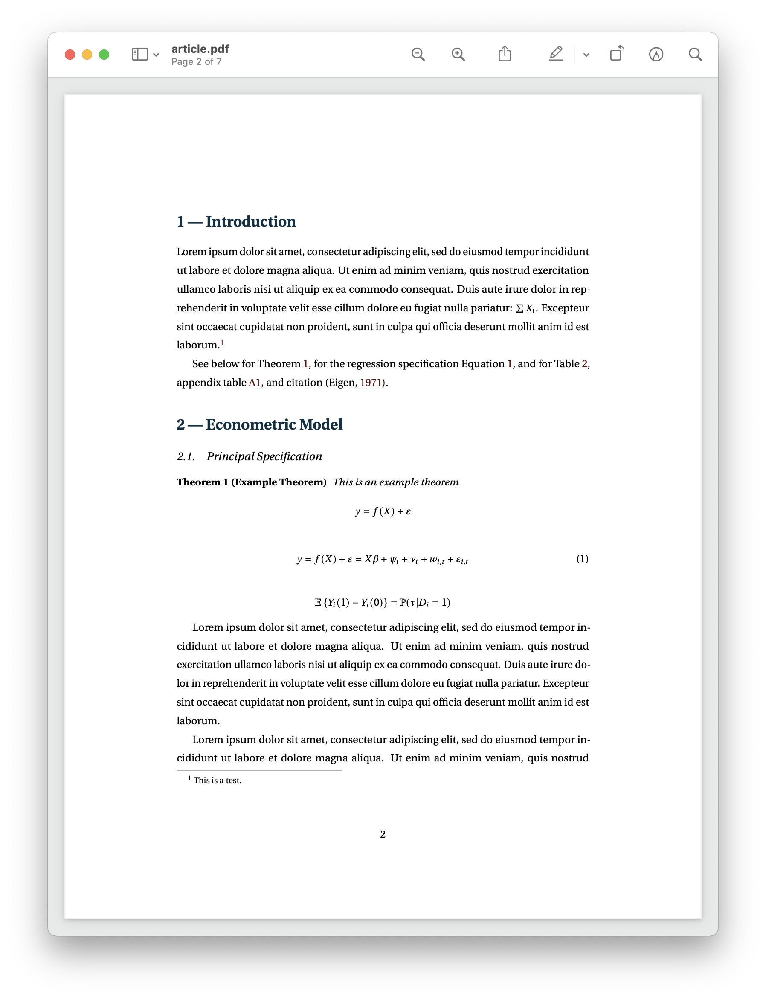
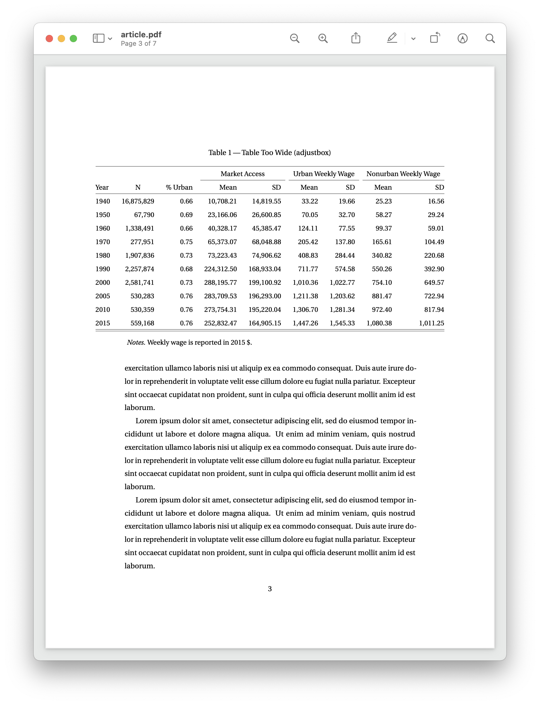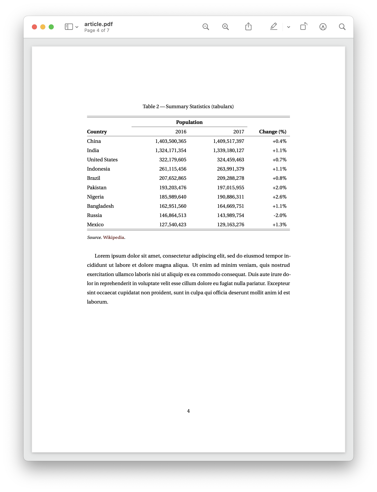

---
# Latex Slides

Well commmented preamble so you don't end up with "preamble blought"

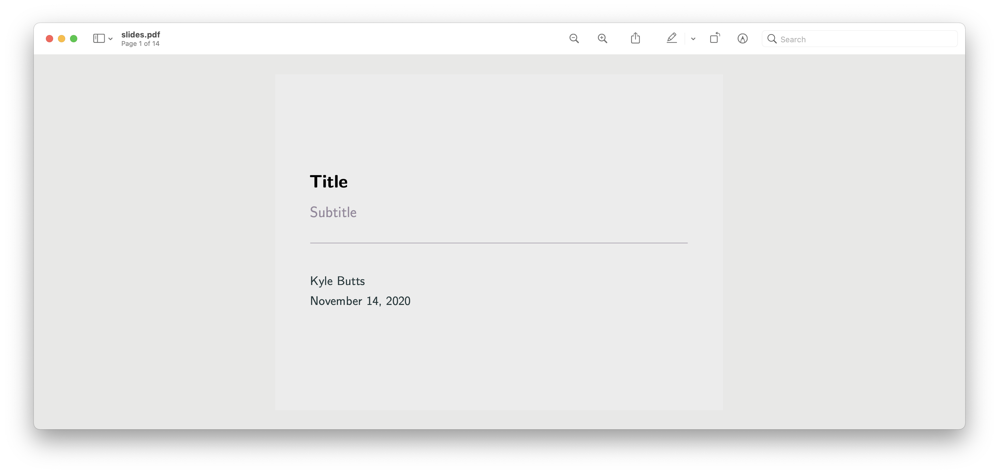
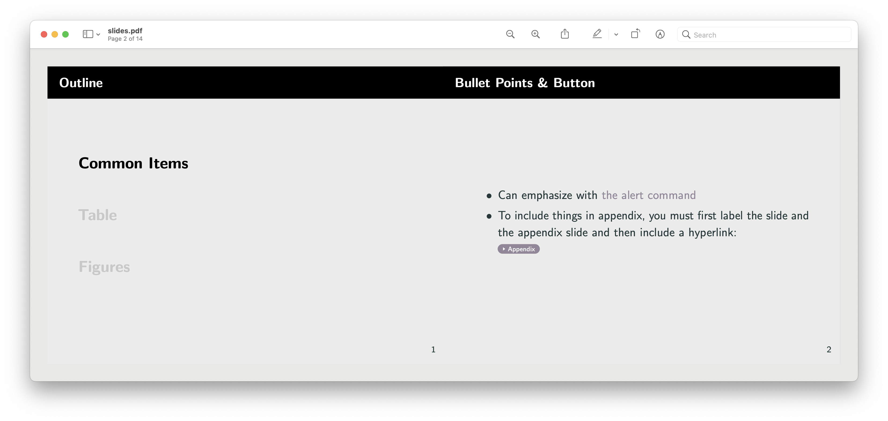
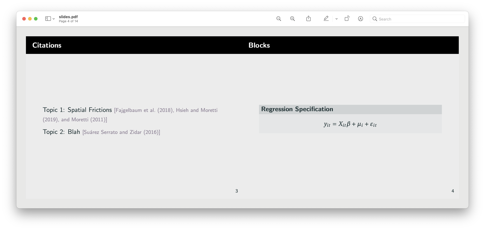
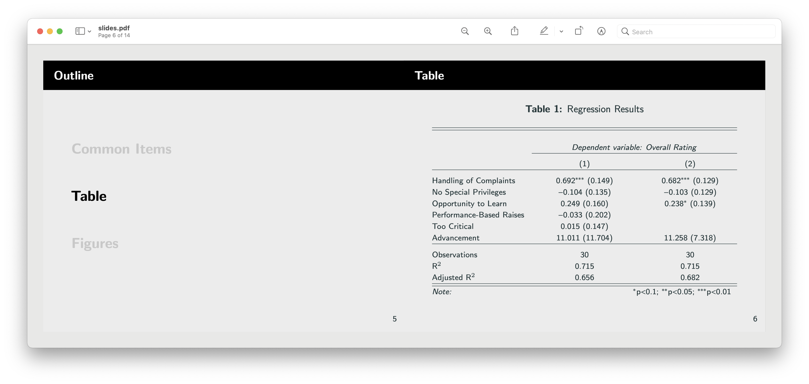

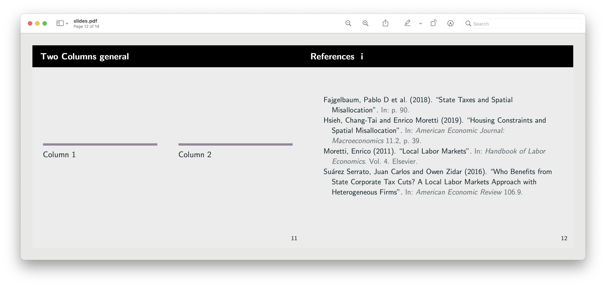

---
# ggplot Theme Function

Function Arguments:
- `title-align`: "left" or "center"
- `base_size`: "_px". Scales all text relative to base_size (size of title)
- `has_subtitle`: TRUE/FALSE. Makes margins right when including a subtitle
- `slides`: TRUE/FALSE. Makes background match my latex slides theme

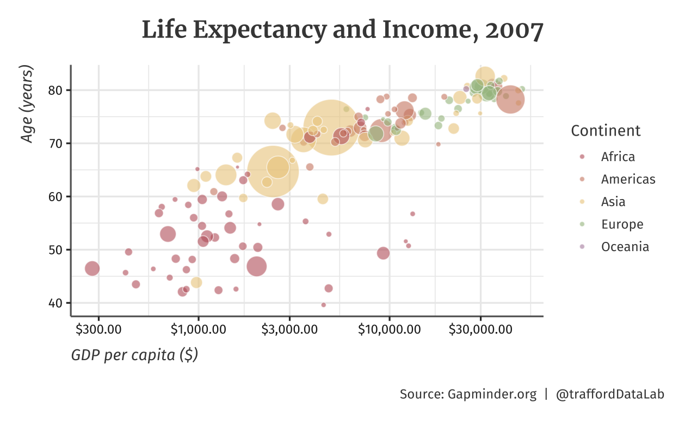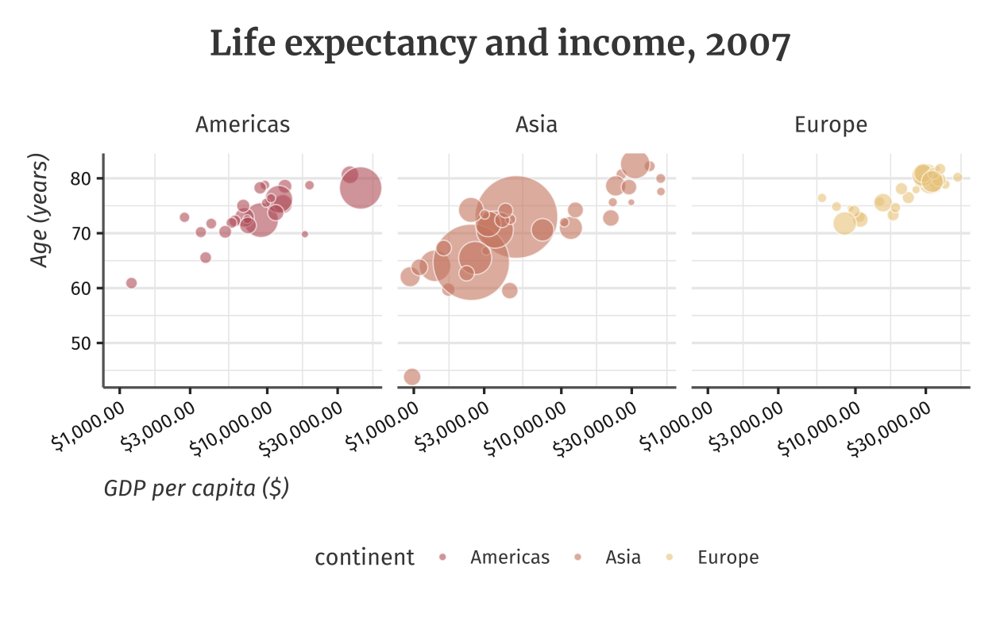
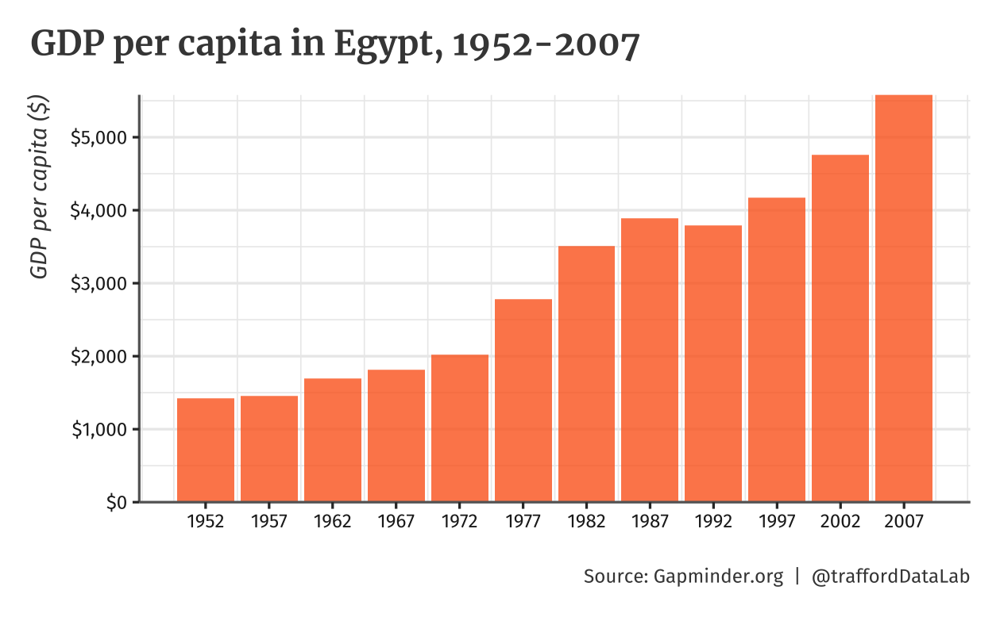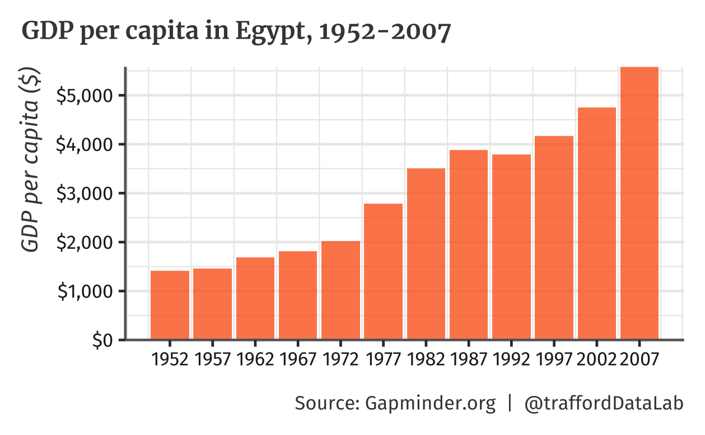
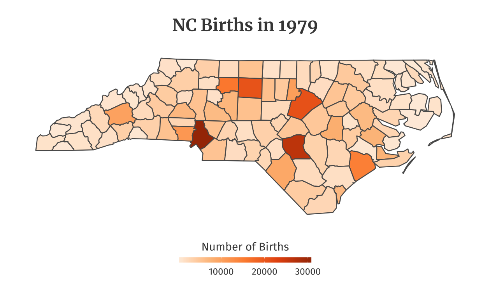
