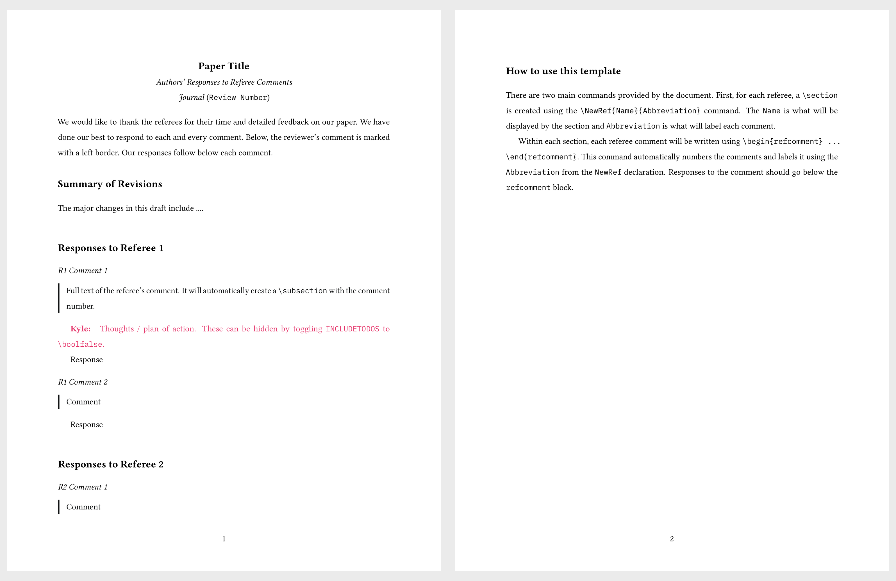

# Latex templates

This is a repository of all my latex templates. I've done my best to document every line of code for these themes so that you can understand what it does and delete/modify things as you see fit. You can see a live preview of each one here:

[Slides](https://raw.githack.com/kylebutts/latex-templates/main/latex-slides/slides.pdf) | 
[Article](https://raw.githack.com/kylebutts/latex-templates/main/latex-article/article.pdf) | 
[Referee Report](https://raw.githack.com/kylebutts/latex-templates/main/referee-response/responses.pdf)


## Latex Slides 

<!-- latex-slides -->
[](thumbnails/latex-slides-1.png)
[](thumbnails/latex-slides-2.png)
<!-- latex-slides -->

This latex slide aims for nice typography, minimal aesthetics so the focus is on the content, and a set of helpful commands including easily colored words, full-size image frames, table highlighting, multi-column layouts, and more. The theme is highly customizable with (1) a well commented `slides.sty` file so you can tweak it and make it your own and (2) by defining the colors in the top of your document:

```latex
% Define `accent`/`accent2` colors for theme customization
\definecolor{accent}{HTML}{006896}
\definecolor{accent2}{HTML}{E64173}
\usepackage{slides}
```


## Latex Article

<!-- latex-article -->
[](thumbnails/latex-article-1.png)
[](thumbnails/latex-article-2.png)
<!-- latex-article -->


This is how I write my papers. There's not many special bells and whistles, but I think it looks nice and clean. 

### Math commands

I have a set of math commands in `math.sty` that borrow heavily from [Pascal Michaillat](https://github.com/pmichaillat/latex-math). See the document for examples of what I've included.

### Easily-hideable comments in paper

This also includes a very useful way to leave notes in a document. Then, you can comment `\kyle{Thoughts here}` to leave a comment. Toggling `\booltrue` to `\boolfalse` will hide the comments from the document.

```tex
% Conditionally display thoughts (hide by switching to `\boolfalse`)
\booltrue{INCLUDECOMMENTS}
\newcommand{\kyle}[1]{\coauthorComment[Kyle]{#1}}
```

#### Use `biblatex` instead of `natbib`

In paper.sty, replace
```tex
\usepackage{natbib}
\bibliographystyle{econ-aea}
```
with 
```tex
\usepackage[
  style = chicago-authordate,
  doi = true, 
  backend = biber,
  natbib = true
]{biblatex}
\usepackage[authordate, backend = biber]{biblatex-chicago}
```

2. Add the following 

In the main document, do the following: 
1. Add `\addbibresource{references.bib}` before `\begin{document}`
2. Replace `\bibliography{references.bib}` with ` `


## Response to Referees

<!-- referee-response -->
[](thumbnails/referee-response-1.png)
<!-- referee-response -->

The goal of this is to make referee reports look nice and make it easy to structure the document. For each referee, use this to create a section with the referee:

```tex
\NewRef{Referee 1}{R1}
```

Then for each comment, wrap the referee's comment with a `refcomment` environment and it will create a subsection and automatically number the comments
```tex
\begin{refcomment}

\end{refcomment}
```


## .gitignore

This is a recommended set of files to include in `.gitignore` to not commit ugly latex auxiliary files:

```text
*.aux
*.lof
*.log
*.lot
*.fls
*.out
*.toc
*.fmt
*.fot
*.cb
*.cb2
.*.lb
*.bbl
*.bcf
*.blg
*.fdb_latexmk
*.run.xml
*.synctex.gz
*.nav
*.snm
```
